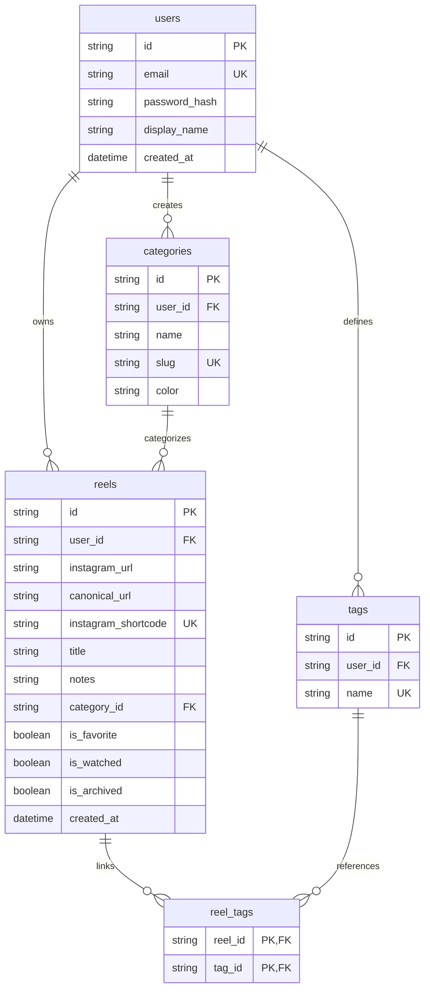

# ReelVault 🎬

<p align="center">
  
  
  
  
  
  
  
</p>

<h3 align="center">
  <b>Personal Instagram Reel Bookmark & Knowledge Management Platform</b>
</h3>

<p align="center">
  A high-speed personal "second brain" designed specifically for saving, categorizing, researching, and searching Instagram Reels.
  <br />
  Eliminates messy copy-pasting into WhatsApp, Notes, or Telegram bookmarks.
</p>

<p align="center">
  <a href="#-the-core-problem--solution">Problem & Solution</a> •
  <a href="#-key-features">Features</a> •
  <a href="#-architecture">Architecture</a> •
  <a href="#-database--schema">Database</a> •
  <a href="#-api-reference">API Spec</a> •
  <a href="#-security-model">Security</a> •
  <a href="#-getting-started">Quickstart</a> •
  <a href="#-keyboard-shortcuts">Shortcuts</a> •
  <a href="#-license">License</a>
</p>

---

## ⚡ The Core Problem & Solution

| ❌ The Clunky Traditional Workflow | ✅ The ReelVault Experience |
|---|---|
| Copy Reel link from Instagram | Copy Reel link from Instagram |
| Paste into WhatsApp "Message Yourself", Notes, or Telegram | Press **`N`** anywhere in ReelVault and hit **Enter** |
| Links get buried under months of chat history | Clean, searchable vault with categorized tags & notes |
| No preview, no notes, duplicate links everywhere | Sub-second canonical normalization & duplicate rejection |
| Impossible to filter by topic, creator, or watched state | Composable filtering by category, status, and tag |

```
                    ┌─────────────────────────┐
                    │  Instagram Reel Found   │
                    └────────────┬────────────┘
                                 │ Copy Link
                                 ▼
                    ┌─────────────────────────┐
                    │     Open ReelVault      │
                    │   (Press 'N' Key Focus) │
                    └────────────┬────────────┘
                                 │ Quick Save
                                 ▼
        ┌──────────────────────────────────────────────────┐
        │  • Canonical URL Normalization (Strips Tracking) │
        │  • Duplicate Prevention (409 Conflict Guard)     │
        │  • Personal Notes & Lowercase Tag Cleaning       │
        └────────────────────────┬─────────────────────────┘
                                 │
                                 ▼
                    ┌─────────────────────────┐
                    │  Organize / Search (/)  │
                    │  Open Reel on Instagram │
                    └─────────────────────────┘
```

---

## ✨ Key Features

- **⚡ Sub-Second Quick Save:** Instant validation, stripping of tracking tokens (`?utm_source=...`, `?igsh=...`), and canonical normalization (`https://www.instagram.com/reel/<shortcode>/`).
- **🛡️ Strict Duplicate Detection:** Enforced at both application and database level (`UNIQUE(user_id, instagram_shortcode)`). Never save the same Reel twice.
- **🔍 Multi-Field Server-Side Search:** Instant search across titles, personal notes, tags, creator usernames, and URLs (Shortcut: **`/`**).
- **🏷️ Composable Organization:** Filter simultaneously by Watch Status (*All, Watched, Unwatched*), Favorites (*Starred*), Archive, Custom/Default Categories, and Tags.
- **⌨️ Keyboard-First Power Shortcuts:**
  - `N` — Focus Quick Save URL bar
  - `/` — Focus Search bar
  - `G then D / S / F / A / T` — Navigate tabs (*Dashboard, Saved, Favorites, Archive, Tags*)
  - `?` — Toggle Shortcuts modal
  - `Esc` — Dismiss modals / clear search
- **📊 Vault Metrics & Analytics:** View total saved count, completion percentage, favorites count, and tag distribution.
- **📤 Zero Vendor Lock-in Export:** Instant download of your entire library as structured **JSON** or spreadsheet-ready **CSV**.
- **🌗 Minimalist SaaS Aesthetic:** Tailored Dark and Light themes inspired by Linear, Raycast, and Arc with fluid micro-interactions and zero layout shifts.

---

## 🏛 Architecture

ReelVault is designed as a single-tier, zero-external-dependency application. The Node.js Express server delivers both the strictly validated REST API and serves the production-bundled React 19 Single Page Application.

```mermaid
graph TD
    subgraph Client ["Client Layer (React 19 + TypeScript + Vite 6)"]
        UI[App Shell & Header]
        SaveBar[QuickSaveBar (Shortcut: 'N')]
        Grid[ReelCard Grid & Detail Drawer]
        Filters[FilterBar & Search (Shortcut: '/')]
        Themes[Vanilla CSS Design Tokens (Dark / Light)]
    end

    subgraph Server ["Server Layer (Node.js 22 + Express 4)"]
        Sec[Helmet + CORS + Rate Limiter]
        AuthMid[JWT Bearer & Scrypt Crypto Auth]
        ZodVal[Zod Request Schema Validation]
        Routes[API Routes: /reels, /categories, /tags, /stats, /export]
        Services[Domain Services & Business Transactions]
    end

    subgraph Storage ["Storage Layer (Native node:sqlite)"]
        DB[(Embedded SQLite DB)]
        WAL[WAL Mode & Foreign Keys ON]
        Indexes[Composite Performance Indices]
    end

    Client -->|HTTP / REST (JWT)| Sec
    Sec --> AuthMid
    AuthMid --> ZodVal
    ZodVal --> Routes
    Routes --> Services
    Services --> DB
    DB -.-> WAL
    DB -.-> Indexes
```

---

## 🗄 Database & Schema

ReelVault utilizes Node.js's native embedded SQLite engine (`node:sqlite`) with Write-Ahead Logging (`WAL`) mode and strict foreign keys enabled for zero-latency relational integrity.



### Uniqueness & Index Optimization
- **`uq_user_reel_shortcode`**: Hard constraint `UNIQUE(user_id, instagram_shortcode)` guarantees duplicate prevention per user while allowing multiple users to bookmark the same public reel independently.
- **Index Composite Set**:
  - `idx_reels_user_shortcode` on `(user_id, instagram_shortcode)`
  - `idx_reels_user_created` on `(user_id, created_at DESC)`
  - `idx_reels_user_archived` on `(user_id, is_archived, created_at DESC)`
  - `idx_reels_user_favorites` on `(user_id, is_favorite, is_archived, created_at DESC)`
  - `idx_reels_user_watched` on `(user_id, is_watched, is_archived, created_at DESC)`
  - `idx_reels_user_category` on `(user_id, category_id, is_archived)`

---

## 🔌 API Reference

All protected routes require `Authorization: Bearer <TOKEN>`.

### Authentication Endpoints
| Method | Endpoint | Description | Payload / Query | Response |
|---|---|---|---|---|
| `POST` | `/api/auth/register` | Register new account & seed categories | `{ email, password, displayName? }` | `201 Created` + JWT |
| `POST` | `/api/auth/login` | Sign in existing user | `{ email, password }` | `200 OK` + JWT |
| `GET` | `/api/auth/me` | Fetch authenticated profile | *None* | `200 OK` (User) |

### Reels Management Endpoints
| Method | Endpoint | Description | Payload / Query | Response |
|---|---|---|---|---|
| `POST` | `/api/reels` | Quick Save Instagram Reel | `{ url, title?, notes?, categoryId?, tags? }` | `201 Created` / `409 Conflict` |
| `GET` | `/api/reels` | Multi-field search & composable filter | `?q=&status=&favorite=&archived=&categoryId=&tag=&sort=&limit=` | `200 OK` (Reels + Pagination) |
| `GET` | `/api/reels/:id` | Get single reel by ID | *None* | `200 OK` / `404 Not Found` |
| `PATCH` | `/api/reels/:id` | Update metadata, notes, tags | `{ title?, notes?, categoryId?, tags? }` | `200 OK` (Updated Reel) |
| `DELETE` | `/api/reels/:id` | Permanently remove reel | *None* | `200 OK` (`{ id }`) |
| `POST` | `/api/reels/:id/favorite` | Toggle favorite star | *None* | `200 OK` (`isFavorite: boolean`) |
| `POST` | `/api/reels/:id/watched` | Toggle watched status | *None* | `200 OK` (`isWatched: boolean`) |
| `POST` | `/api/reels/:id/archive` | Toggle archive status | *None* | `200 OK` (`isArchived: boolean`) |

### Categories, Tags & Utilities
| Method | Endpoint | Description | Query / Body | Response |
|---|---|---|---|---|
| `GET` | `/api/categories` | List user categories | *None* | `200 OK` (Array) |
| `POST` | `/api/categories` | Create custom category | `{ name, color? }` | `201 Created` |
| `DELETE` | `/api/categories/:id` | Delete category (reels set to NULL) | *None* | `200 OK` |
| `GET` | `/api/tags` | List all tags with item counts | *None* | `200 OK` (Array) |
| `DELETE` | `/api/tags/:id` | Delete tag association | *None* | `200 OK` |
| `GET` | `/api/stats` | Vault metrics summary | *None* | `200 OK` (VaultStats) |
| `GET` | `/api/export` | Export library data | `?format=json` or `?format=csv` | File Download |

---

## 🛡️ Security Model

ReelVault implements defense-in-depth engineering:

1. **Insecure Direct Object Reference (IDOR) Hardening:**  
   Every query is strictly parameterized and scoped: `WHERE r.id = ? AND r.user_id = ?`. Users cannot read, tamper with, or delete other users' records.
2. **Cryptographic Password Security:**  
   Passwords are encrypted with Node's native `crypto.scryptSync` using a cryptographically random 16-byte salt (`salt:derivedKey`). Passwords are verified with `crypto.timingSafeEqual` to eliminate timing attacks.
3. **URL Parsing & Protocol Sanitization:**  
   Rejects `javascript:`, `data:`, `vbscript:`, and third-party phishing domains. Only `instagram.com` and `instagr.am` domains with valid `/reel/`, `/reels/`, or `/p/` shortcodes are accepted.
4. **SQL Injection Immunity:**  
   100% of queries use SQLite prepared statements with parameter binding. Payloads like `' OR 1=1 --` are treated as literal search strings without syntax leakage.
5. **Rate Limiting & Payload Guards:**  
   Express limits IP requests to 600 requests per 15 minutes and caps JSON bodies at 100KB to protect against Denial of Service (DoS).
6. **Error Masking:**  
   Internal error stacks are never leaked to the client. Responses follow a standardized `{ success: false, error: { code, message } }` contract.

---

## 🧪 Comprehensive Automated Testing

ReelVault features 100% passing multi-tier tests:

```bash
# Run complete test suite (Unit, Security, Integration)
npm test

# Run individual test layers
npm run test:unit       # URL parsing, query sanitization, tag normalization
npm run test:security   # IDOR isolation between multi-tenant users
npm run test:api        # Auth lifecycle, Reels CRUD, duplicates, toggles
npm run test:e2e        # Live end-to-end verification against running server
```

### Verification Checklist
```text
✔ parseInstagramUrl - valid reel urls with and without tracking
✔ parseInstagramUrl - rejects malicious protocols and external domains
✔ normalizeTags - cleans, strips #, dedupes, and lowercases
✔ Crypto - scrypt hashing, salts, and timing safe verification
✔ URL Parser - sanitizes malicious query strings and maintains shortcode integrity
✔ Tag Normalizer - strips punctuation, emojis, and normalizes casing
✔ SQL Injection Resiliency - complex SQL injection strings in search queries
✔ Category Isolation and Cascade Safety
✔ Reel Tag Cleanup on Reel Deletion
✔ Auth API - register, login, and verify profile
✔ Reels API - Save, Duplicate Prevention, Search, Filter, and Toggles
✔ Security & IDOR Isolation - User A and User B cannot access each other data
✔ Live E2E Verification - Health, SPA delivery, save, duplicate 409, export
```

---

## 🚀 Getting Started

### Prerequisites
- Node.js 22.0.0 or higher
- npm 10.0.0 or higher

### Installation & Setup

1. **Clone the repository:**
   ```bash
   git clone https://github.com/thejasteju54-lgtm/reelvault.git
   cd reelvault
   ```

2. **Install dependencies:**
   ```bash
   npm install
   ```

3. **Configure environment:**
   ```bash
   cp .env.example .env
   ```

4. **Start local development servers:**
   ```bash
   npm run dev
   ```
   *Express server starts on port `4000`, and Vite React client starts on port `5173` with automatic API proxying.*

---

## 📦 Production Build & Deployment

### 1. Build Production Assets
```bash
npm run build
```
*Compiles the React SPA into `dist/client/` and the TypeScript server into `dist/server/`.*

### 2. Run the Production Server
```bash
npm start
```
*Launches the consolidated Node server at `http://localhost:4000`, delivering both the REST API and the static React SPA.*

### 3. Docker Deployment
A lightweight Alpine Docker container can be deployed to Render, Railway, Fly.io, or VPS:

```dockerfile
FROM node:22-alpine AS builder
WORKDIR /app
COPY package*.json tsconfig*.json vite.config.ts index.html ./
RUN npm ci
COPY src/ ./src/
RUN npm run build

FROM node:22-alpine
WORKDIR /app
ENV NODE_ENV=production
COPY package*.json ./
RUN npm ci --omit=dev
COPY --from=builder /app/dist ./dist
EXPOSE 4000
CMD ["node", "dist/server/index.js"]
```

---

## ⌨️ Keyboard Shortcuts

| Shortcut | Description |
|:---:|---|
| <kbd>N</kbd> | Focus Quick Save bar to paste an Instagram Reel URL |
| <kbd>/</kbd> | Focus Search bar to instantly filter your vault |
| <kbd>Esc</kbd> | Dismiss any open modal dialog or detail drawer |
| <kbd>G</kbd> then <kbd>D</kbd> | Navigate to **Dashboard** |
| <kbd>G</kbd> then <kbd>S</kbd> | Navigate to **Saved Reels** |
| <kbd>G</kbd> then <kbd>F</kbd> | Navigate to **Favorites** |
| <kbd>G</kbd> then <kbd>A</kbd> | Navigate to **Archive** |
| <kbd>G</kbd> then <kbd>T</kbd> | Navigate to **Tags** |
| <kbd>?</kbd> | Open Keyboard Shortcuts cheatsheet |

---

## 🗺 Roadmap

- [ ] **Browser Extension (Chrome / Firefox):** 1-click reel bookmarking directly while browsing `instagram.com`.
- [ ] **Mobile PWA Web Share Target:** Support for native "Share to ReelVault" directly from the official Instagram mobile app.
- [ ] **AI Auto-Tagging:** Optional Gemini 2.5 integration to extract concepts and auto-tag reel transcripts.
- [ ] **Custom Collections:** Group reels into shareable thematic collections or playlists.

---

## 📄 License

Distributed under the **MIT License**. Crafted with clean software engineering, zero external bloat, and modern design principles.
